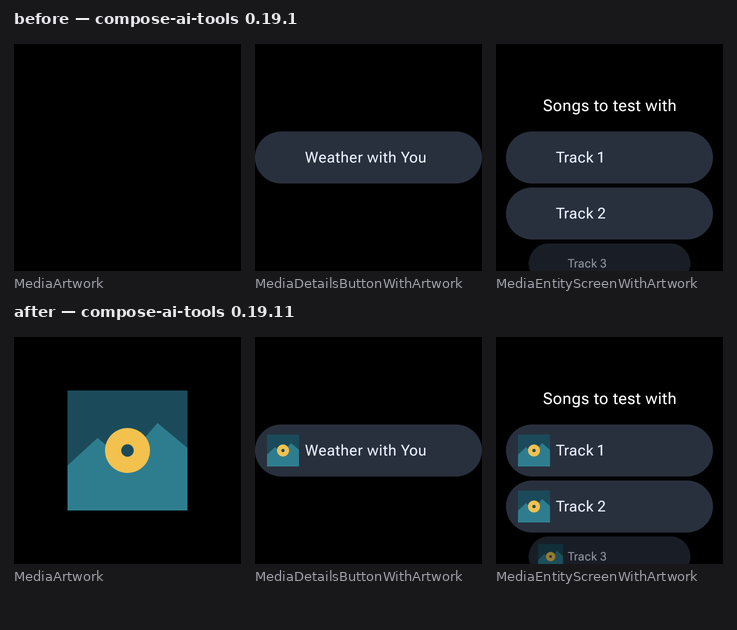

# Horologist preview catalog

One Gradle module, `:catalog`, holding curated `@Preview`s for Horologist's UI surfaces across both
form factors. Rendered outside Android Studio by the
[`ee.schimke.composeai.preview`](https://github.com/yschimke/compose-ai-tools) plugin:

```
./gradlew :catalog:composePreviewRenderAll
# PNGs land in catalog/build/compose-previews/renders/
```

## Why one module

Wear and mobile share a module rather than splitting into `:catalog:wear` and `:catalog:mobile`.
The device is a per-preview property — `@Preview(device = "id:pixel_7")` versus
`@Preview(device = "id:wearos_large_round")` — not a per-module one, so a split would buy nothing
and cost a second module, a second render invocation, and a duplicated dependency block. Verified
end to end: a single `composePreviewRenderAll` renders the Wear stickers at 227×227dp and the phone
stickers at 411×914dp in the same pass.

## How sections are declared

Sections are annotations, not configuration. There is no catalog JSON, no manifest, and no registry
to keep in sync — [`CatalogPreviews.kt`](src/main/java/com/google/android/horologist/catalog/CatalogPreviews.kt)
declares one multipreview annotation per (area, form factor) pair, each fixing the device, the
background, and the `group`:

```kotlin
@Preview(device = "id:wearos_large_round", backgroundColor = 0xFF000000, showBackground = true, group = "Media")
public annotation class MediaCatalog
```

and a preview is then just:

```kotlin
@MediaCatalog
@Composable
internal fun MediaNothingPlayingDisplay() { … }
```

The group reaches `previews.json` and the rendered filenames
(`MediaNothingPlayingDisplay_Media.png`), so the grouping is visible to every downstream consumer
without anything else being declared anywhere.

The form factor is only spelled out when an area spans both — `Auth Wear` / `Auth Mobile`. An area
that only exists on the watch is just `Media`, `Material`, `Composables`, `Health`, and reads as
Wear by default, matching how Horologist itself is described.

Adding an area means adding an annotation and a file. Nothing in the build wiring is per-area.

| Section | Form factor | Previews | Source library |
| --- | --- | --- | --- |
| Material | Wear | 16 | `:compose-material` |
| Media | Wear | 16 | `:media:ui-material3` |
| Auth Wear | Wear | 13 | `:auth:composables-material3`, `:auth:ui-material3` |
| Composables | Wear | 10 | `:composables` |
| Health | Wear | 7 | `:health:composables` |
| Audio | Wear | 5 | `:media:audio-ui-material3` |
| AI | Wear | 5 | `:ai:ui` |
| Layout | Wear | 3 | `:compose-layout` |
| DataLayer Mobile | Phone | 3 | `:datalayer:phone-ui` |
| Auth Mobile | Phone | 2 | `:datalayer:phone-ui` |

80 previews in total, of which 72 are published — see the known gap below. Sections cover a
component's *states*, not just its happy path — disabled
seek buttons at a queue end, an account row with no display name, a five-digit metric, an empty and
a complete segmented indicator — because those are the cases that break and the ones a static
screenshot is good at catching.

Previews that would otherwise read the wall clock (the date/time pickers, the AI prompt timestamp,
exercise durations) take fixed values. A preview whose output depends on `now()` renders
differently on every run and reports as a spurious diff on every PR.

The same rule governs artwork. The Media section's artwork-bearing previews (`MediaArtwork`,
`MediaDetailsButtonWithArtwork`, `MediaEntityScreenWithArtwork`) load a local drawable through
`CoilPaintable`, not a remote URL — the renderer resolves coil requests inline but refuses
`http(s)://` models on purpose, since pixels that depend on live egress aren't reproducible.

They are new, because until compose-ai-tools 0.19.11 coil-backed images captured blank: the load
never started under the renderer's inspection mode, and an unresolved `AsyncImagePainter` reports no
intrinsic size, so it also collapsed the layout around it. That is what the top row below is —
the same three previews, same code, one plugin version earlier
([compose-ai-tools#2952](https://github.com/yschimke/compose-ai-tools/issues/2952)):



## Relationship to the per-library previews

Several libraries already apply the same plugin and render whatever previews happen to live in
their own `src/debug` (`:auth:composables`, `:compose-material`, `:media:ui`, …). Those stay as
they are — they're the library author's working previews. This module is the curated counterpart:
one place where a surface is previewed with realistic data, on the device it ships to, grouped so a
reader can navigate by area rather than by Gradle path.

## Known gap: dialogs and bottom sheets render blank, and are withheld

72 of the 80 previews render with real content. The 8 that don't are all dialog-shaped:

- `AuthWearSignedInConfirmationDialog` and its two variants (Wear `Dialog`)
- every `Auth Mobile` and `DataLayer Mobile` sticker (`ModalBottomSheet`)

`Dialog`- and `ModalBottomSheet`-based composables compose into their own window with their own
`ViewRootImpl` and Compose root, and the renderer's capture reads the host activity's root. Those
previews are discovered, sized (411×914dp for the phone sheets), and grouped correctly — only the
pixels are missing, and with them the semantics tree, so the export reports them under
`no semantics for: …`.

This is a renderer-side limitation, not a catalog one: the same previews are blank whether they
live here or in a library's `src/debug`. Tracked upstream as
[yschimke/compose-ai-tools#3048](https://github.com/yschimke/compose-ai-tools/issues/3048), with a
reproduction and the investigation notes on `agent/dialog-window-capture` — capturing the dialog's
decor view fails Espresso's activity-scoped view matching, and capturing its Compose root returns
transparent pixels because the capture path is bound to the activity window's surface.

**The eight are withheld from [`catalog.spec.json`](../catalog.spec.json)** rather than published
as empty stickers. A blank sticker on a browsable sheet is worse than an absent one: it reads as
"this is what the component looks like". Withholding them also lets `design-artifacts.yml` run with
`allow-incomplete: false`, so the completeness gate stays on for everything the catalog *does*
declare — with the flag set, a genuinely broken render elsewhere would have published unnoticed.

The `@Preview`s stay in this module, so when #3048 lands the fix is to put the entries back in the
spec — the previews themselves need no change. Note the whole phone form factor is in that set:
every `Auth Mobile` and `DataLayer Mobile` sticker is a `ModalBottomSheet`, so the published catalog
is Wear-only until then.
